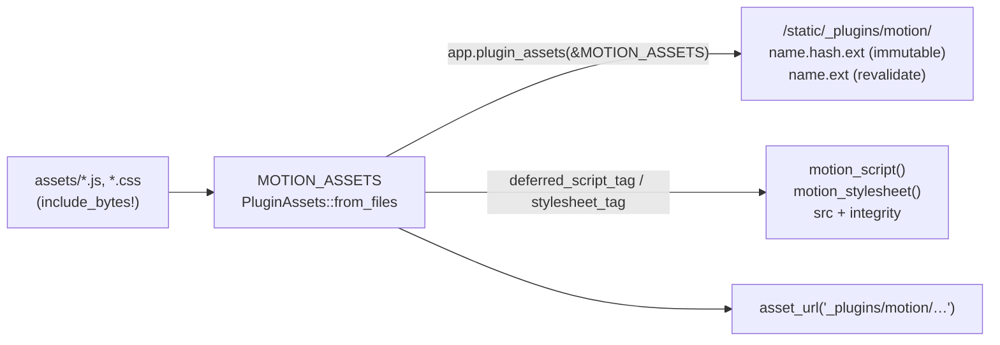

# ADR 0001 — Serve assets through Autumn's `plugin_assets` seam

- Status: accepted
- Date: 2026-10-05
- Applies to: autumn-plugin-motion 0.2.0, autumn-web 0.8.0

## Context

Through 0.1.x the plugin merged its own axum router serving
`/__motion/motion.min.js`, `/__motion/init.js` and `/__motion/motion.css`
with a one-day public cache. The `<script>`/`<link>` helpers read
hand-kept `sha384` constants (`INIT_JS_INTEGRITY`, `MOTION_CSS_INTEGRITY`,
`MOTION_JS_INTEGRITY`), mirrored in `assets/manifest.json` and guarded by a
test. Every `init.js` edit meant re-hashing in two places, and the URLs
were not content-addressed, so browsers could hold stale bytes for a day
after an upgrade — which also broke SRI for that window.

autumn-web 0.8.0 adds `PluginAssets` and `AppBuilder::plugin_assets`:
a plugin hands the framework a static bundle and gets content-hashed URLs
under `/static/_plugins/<namespace>/`, immutable caching, ETag/304, Range,
computed SRI, `asset_url` resolution, and route-listing/conformance
integration.

## Decision

- Declare one bundle, `MOTION_ASSETS`, with namespace `motion`, and install
  it from `MotionPlugin::build` via `app.plugin_assets(&MOTION_ASSETS)`.
- Build it with `PluginAssets::from_files` + `include_bytes!` rather than
  `plugin_assets!` (directory embed), so that:
  - `assets/manifest.json` (vendoring provenance) is never served, and
  - the plugin no longer forces autumn-web's `embed-assets` feature on
    host apps.
- `motion_script()` / `motion_stylesheet()` delegate to the bundle's
  `deferred_script_tag` / `stylesheet_tag`.
- Keep `MOTION_JS_INTEGRITY` as a provenance pin for the vendored upstream
  bytes (tested against the bundle); drop the plugin-authored file hashes.
- Remove `motion_routes()` and the `/__motion/*` paths outright (no
  redirect shim): the crate is pre-1.0 and the 0.8 bump is already
  breaking.

## Consequences

- No hand-kept hashes for plugin-authored files; editing `init.js` or
  `motion.css` needs no re-pinning.
- Upgrades are cache-safe: new bytes get a new URL.
- Breaking for anyone who hard-coded `/__motion/*`, called
  `motion_routes()`, or read `INIT_JS_INTEGRITY` / `MOTION_CSS_INTEGRITY`;
  migration notes live in the README ("Upgrading from 0.1").
- Requires autumn-web `0.8`.
